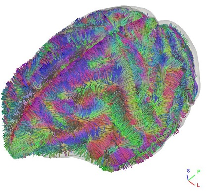

[PRIME-DE](http://fcon_1000.projects.nitrc.org/indi/indiPRIME.html) data aggregation is carried out through the International Neuroimaging Data-sharing Initiative (INDI)(Mennes et al. 2013) portal located at the NeuroimagingInformatics Tools and Resources Clearinghouse (NITRC)(http://fcon_1000.projects.nitrc.org/indi/indiPRIME.html).

## License
[Creative Commons -- Attribution-NonCommercial Share Alike (CC-BY-NC-SA)](https://creativecommons.org/licenses/by-nc-sa/4.0/)

## Download

- FIB Files

  These files can be opened in DSI Studio \[Step T2 Fiber tracking\] to generate tractography. The gradient distortion was corrected using two different phase encoding scans. The diffusion data were reconstructed using generalized q-sampling imaging (Yeh et al., IEEE TMI, ;29(9):1626-35, 2010) with a diffusion sampling length ratio of 1. The restricted diffusion was quantified using restricted diffusion imaging (Yeh et al., MRM, 77:603--612 (2017)).

- SRC FIles [(OneDrive)](https://pitt-my.sharepoint.com/:f:/g/personal/yehfc_pitt_edu/EosMHbAZzzdLgVhNIl3ovoIBIytVFw_qvqZ01bPzuPlffg?e=eI4wlO)[(Zenodo)](https://zenodo.org/record/6321169)

## Reference
MILHAM, Michael P., et al. "An Open Resource for Non-human Primate Imaging". Neuron, 2018.
